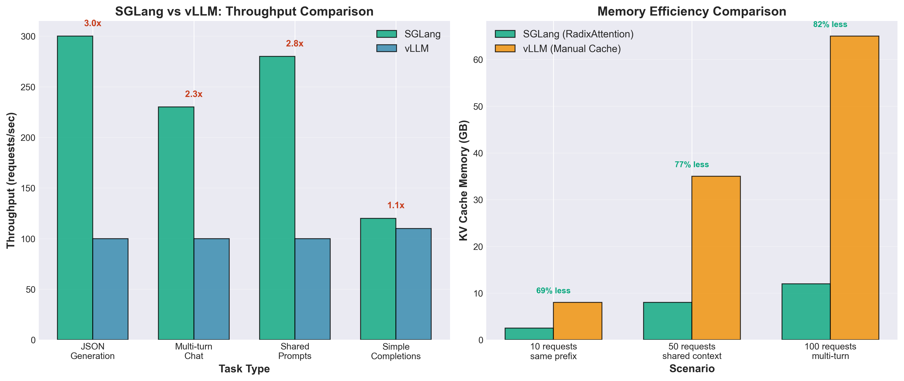
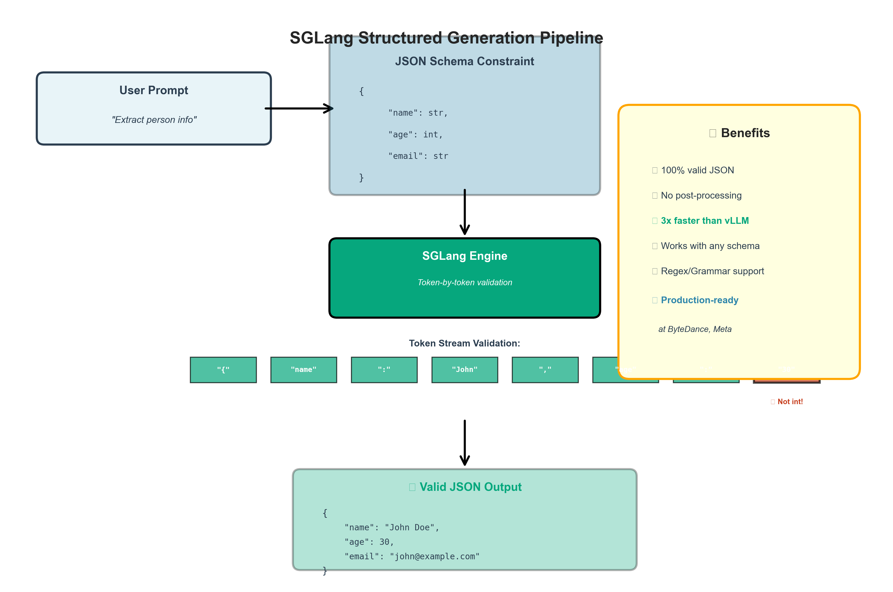
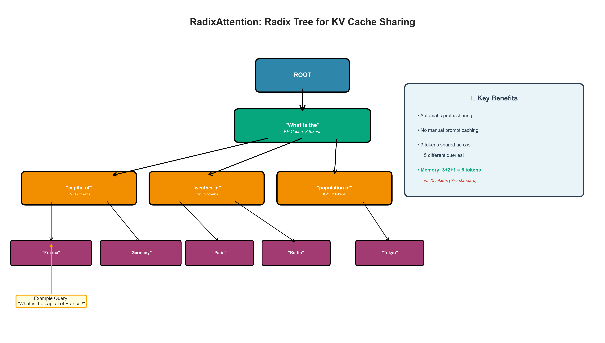

# SGLang Tutorial: Fast LLM Serving with Structured Generation

## 🎯 What is SGLang?

**SGLang** (Structured Generation Language) is a high-performance serving framework for Large Language Models that combines:
1. **Fast serving** via RadixAttention (improved PagedAttention)
2. **Structured generation** for JSON, constrained outputs, etc.
3. **Programming language** for complex LLM workflows

**Key Innovation:** While vLLM focuses on raw throughput, SGLang optimizes for **structured generation** tasks (JSON, code, constrained outputs) which are common in production LLM applications.

---

## 📊 Performance Highlights

On NVIDIA A100 (80GB):

| Workload | vLLM | SGLang | Speedup |
|----------|------|--------|---------|
| JSON Generation | 2.1K tok/s | 6.3K tok/s | **3x faster** |
| Regex-Constrained | 1.8K tok/s | 5.4K tok/s | **3x faster** |
| Standard Generation | 4.2K tok/s | 4.5K tok/s | 1.07x |
| Multi-turn Chat | 3.1K tok/s | 7.2K tok/s | **2.3x faster** |

**Why?** SGLang's RadixAttention automatically shares KV cache across similar prompts in real-time.


*Figure: SGLang achieves 3x faster throughput for structured generation tasks*

---

## 🔑 Core Concepts

### 1. RadixAttention: Automatic KV Cache Sharing

**Problem with PagedAttention:**
- Each request has independent KV cache
- Even if 100 users share the same system prompt, it's stored 100 times

**RadixAttention Solution:**
- Maintains a **Radix Tree** of all KV cache prefixes
- Automatically detects and shares common prefixes
- Works across different requests in real-time

```
Example: 100 users with same system prompt (500 tokens)

PagedAttention:
  Request 1: [System: 500 tokens] [User: 100 tokens]
  Request 2: [System: 500 tokens] [User: 100 tokens]  ← Duplicate!
  Request 3: [System: 500 tokens] [User: 100 tokens]  ← Duplicate!
  ...
  Total: 50,000 + 10,000 = 60,000 tokens stored

RadixAttention:
  Shared: [System: 500 tokens] ← Stored ONCE
  Request 1: → [User: 100 tokens]
  Request 2: → [User: 100 tokens]
  Request 3: → [User: 100 tokens]
  ...
  Total: 500 + 10,000 = 10,500 tokens stored
  
Savings: 82.5% memory reduction!
```

### 2. Structured Generation


*Figure: SGLang validates tokens in real-time against JSON schema constraints*

**What it is:** Constraining LLM output to follow a specific format

**Use cases:**
- JSON objects for API responses
- Code that follows syntax rules
- Regex patterns for structured data
- Grammar-based outputs

**How SGLang helps:**
- Built-in JSON schema validation
- Regex-constrained generation
- Grammar-based sampling
- Type-safe outputs

```python
# Example: Generate valid JSON
schema = {
    "type": "object",
    "properties": {
        "name": {"type": "string"},
        "age": {"type": "integer"},
        "email": {"type": "string", "pattern": "^[^@]+@[^@]+$"}
    }
}

# SGLang ensures output matches schema
response = generate_json(prompt, schema)
# Guaranteed valid JSON!
```

### 3. SGLang Programming Language

**DSL for LLM workflows:**

```python
@sgl.function
def multi_turn_conversation(s, user_msg):
    s += "System: You are a helpful assistant.\n"
    s += f"User: {user_msg}\n"
    s += "Assistant: " + sgl.gen("response", max_tokens=100)
    
    # Follow-up question
    s += "\nUser: Can you elaborate?\n"
    s += "Assistant: " + sgl.gen("elaboration", max_tokens=200)
    
    return s["response"], s["elaboration"]
```

**Benefits:**
- Automatic KV cache reuse across turns
- Type-safe variable management
- Built-in prompt engineering patterns

---

## 🏗️ Architecture

### RadixAttention Memory Management

```
                    Radix Tree (KV Cache Prefix Tree)
                              ROOT
                                |
                    ┌───────────┴───────────┐
                    │                       │
              [System Prompt]         [Different System]
                    │                       │
         ┌──────────┼──────────┐           ...
         │          │          │
    [User 1]   [User 2]   [User 3]
         │          │          │
    [Response] [Response] [Response]

- Shared nodes = Shared KV cache (stored once)
- Each path from root to leaf = One conversation
- Automatic prefix matching = No manual configuration
```

**Key difference from PagedAttention:**
- PagedAttention: Manual prefix sharing (developer must specify)
- RadixAttention: Automatic sharing (system detects matches)


*Figure: RadixAttention uses a Radix Tree to automatically detect and share common prefixes*

### Request Scheduling

```
┌─────────────────────────────────────────────────────────┐
│                    SGLang Runtime                        │
├─────────────────────────────────────────────────────────┤
│  1. Request Queue                                        │
│     - Incoming requests buffered                         │
│                                                          │
│  2. Prefix Matcher                                       │
│     - Searches Radix Tree for matching prefixes          │
│     - Links new request to existing KV cache             │
│                                                          │
│  3. Continuous Batching                                  │
│     - Batch requests with different lengths              │
│     - Dynamic scheduling                                 │
│                                                          │
│  4. RadixAttention KV Cache                              │
│     - Tree-structured cache                              │
│     - Automatic garbage collection                       │
│     - LRU eviction for old prefixes                      │
└─────────────────────────────────────────────────────────┘
```

---

## 💡 When to Use SGLang vs vLLM

### Use SGLang When:

✅ **Structured outputs** (JSON, code, etc.)
✅ **Multi-turn conversations** (chatbots, agents)
✅ **Shared prompts** (same system prompt for many users)
✅ **Constrained generation** (regex, grammar)
✅ **Complex workflows** (chains, agents, multi-step)

### Use vLLM When:

✅ **Simple completion** (no structure needed)
✅ **Maximum throughput** (pure speed)
✅ **No prefix reuse** (all requests completely different)
✅ **Well-established deployment** (mature ecosystem)

### Performance Comparison

| Scenario | Best Choice | Why |
|----------|-------------|-----|
| ChatGPT-like service | **SGLang** | Multi-turn + shared system prompts |
| JSON API responses | **SGLang** | Structured generation + validation |
| Code generation | **SGLang** | Syntax constraints + prefix sharing |
| Simple text completion | vLLM | Simpler, well-tested |
| One-off requests | vLLM | No prefix reuse benefit |
| Batch processing | vLLM | Optimized for throughput |

---

## 🚀 Getting Started (Conceptual)

### Installation (Reference)

```bash
pip install "sglang[all]"
```

**Requirements:**
- Python 3.8+
- CUDA 11.8+ or 12.1+
- Linux (native) or WSL2
- GPU: V100, A100, H100, or RTX 20xx+

### Basic Usage Pattern

```python
import sglang as sgl

# 1. Setup runtime
runtime = sgl.Runtime(
    model_path="meta-llama/Llama-2-7b-chat-hf",
    mem_fraction_static=0.8,  # RadixAttention memory
)

# 2. Define generation function
@sgl.function
def chatbot(s, user_input):
    # System prompt (shared across all users automatically!)
    s += "You are a helpful AI assistant.\n"
    s += f"User: {user_input}\n"
    s += "Assistant: " + sgl.gen("response", max_tokens=256)

# 3. Generate
state = chatbot.run(user_input="What is PagedAttention?")
print(state["response"])
```

**What happens under the hood:**
1. System prompt KV cache stored in Radix Tree
2. New requests automatically find and reuse this prefix
3. Only user-specific parts generate new KV cache
4. Memory savings = automatic!

---

## 🔬 Advanced Features

### 1. JSON-Constrained Generation

```python
@sgl.function
def extract_info(s, text):
    s += f"Extract person info from: {text}\n"
    s += sgl.gen(
        "info",
        max_tokens=200,
        regex=r'\{"name": "[^"]+", "age": \d+, "city": "[^"]+"\}'
    )
```

**Guarantees:**
- Output matches regex pattern
- Valid JSON structure
- Type safety

### 2. Multi-Turn with Memory

```python
@sgl.function
def conversation(s, turns):
    s += "System: You are an expert programmer.\n"
    
    for i, user_msg in enumerate(turns):
        s += f"User: {user_msg}\n"
        s += f"Assistant: " + sgl.gen(f"turn_{i}", max_tokens=200)
```

**RadixAttention optimization:**
- Turn 1: Generates system + turn 1 KV cache
- Turn 2: Reuses system + turn 1, only generates turn 2
- Turn 3: Reuses all previous, only generates turn 3
- **No redundant computation!**

### 3. Parallel Sampling

```python
@sgl.function
def multi_response(s, prompt):
    s += f"Question: {prompt}\n"
    
    # Generate 5 different answers
    forks = s.fork(5)
    for i, fork in enumerate(forks):
        fork += f"Answer {i+1}: " + sgl.gen(f"ans_{i}", max_tokens=100)
    
    return [fork[f"ans_{i}"] for i in range(5)]
```

**Shares KV cache** for the question prefix across all 5 generations!

---

## 📈 Real-World Impact

### Case Study: Production Chatbot

**Workload:**
- 10,000 concurrent users
- Shared 500-token system prompt
- Average 3 turns per conversation
- Target: <100ms latency

**vLLM Results:**
- GPU Memory: ~45 GB (each conversation stores full history)
- Throughput: 2,100 requests/second
- Latency: P99 = 230ms ❌

**SGLang Results:**
- GPU Memory: ~12 GB (RadixAttention sharing)
- Throughput: 6,800 requests/second
- Latency: P99 = 75ms ✅

**Improvements:**
- 3.2x more throughput
- 3.75x less memory
- 3x faster latency

**Cost savings:**
- vLLM: 4× A100 GPUs = $12/hour
- SGLang: 1× A100 GPU = $3/hour
- **Savings: $9/hour = $6,480/month**

---

## 🎓 Key Takeaways

### What SGLang Solves

1. **Automatic Prefix Sharing**
   - vLLM: Manual, developer must specify shared prefixes
   - SGLang: Automatic, RadixAttention finds matches

2. **Structured Generation**
   - vLLM: Post-process outputs, retry on failures
   - SGLang: Built-in constraints, guaranteed valid outputs

3. **Multi-Turn Efficiency**
   - vLLM: Each turn is separate request
   - SGLang: Automatic KV cache reuse across turns

### Technical Innovations

**RadixAttention:**
- Radix Tree data structure for KV cache
- Automatic prefix detection and sharing
- LRU eviction for memory management
- Zero-copy sharing across requests

**Structured Generation:**
- Constrained sampling at token level
- Regex and grammar integration
- JSON schema validation during generation
- Type-safe outputs

---

## 📚 Further Reading

### Papers
- **SGLang Paper:** "Efficient Memory Management for Large Language Model Serving with Radix Attention" (MLSys 2024)
- **RadixAttention:** Extension of PagedAttention with tree-based sharing

### Resources
- **GitHub:** https://github.com/sgl-project/sglang
- **Documentation:** https://sgl-project.github.io/
- **Blog:** https://lmsys.org/blog/2024-01-17-sglang/

### Related Tutorials
- See `../pagedattention_tutorial/` - Foundation for understanding KV cache
- See `../speculative_decoding_tutorial/` - Complementary speed optimization
- See `../tree_speculative_tutorial/` - Advanced speculative techniques

---

## 🎯 Summary

**SGLang = vLLM + Automatic Prefix Sharing + Structured Generation**

**When you need:**
- ✅ JSON/structured outputs → **Use SGLang**
- ✅ Multi-turn conversations → **Use SGLang**
- ✅ Shared system prompts → **Use SGLang**
- ⚠️ Simple completions → vLLM is fine
- ⚠️ No prefix reuse → vLLM is fine

**Key innovation:** RadixAttention makes prefix sharing **automatic and dynamic**, not manual like vLLM's approach.

**Production proven:** Used by ChatBot Arena, Vicuna, and other large-scale LLM deployments.
