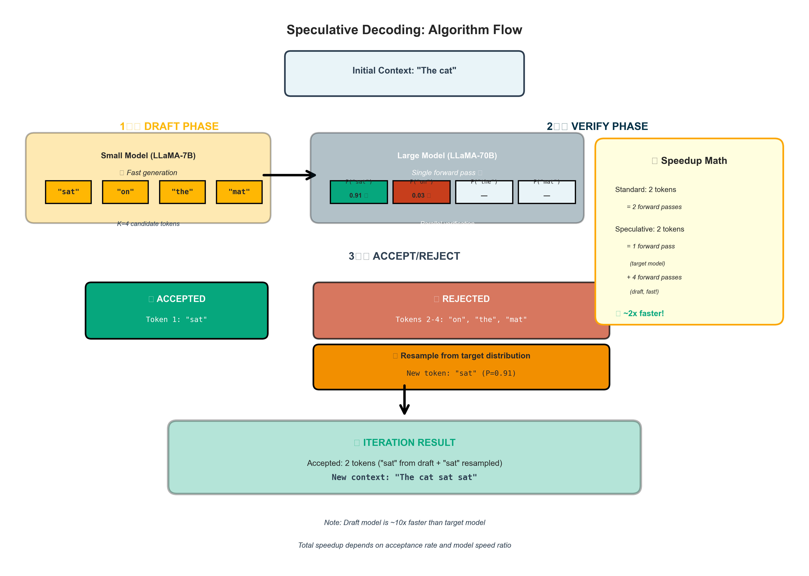
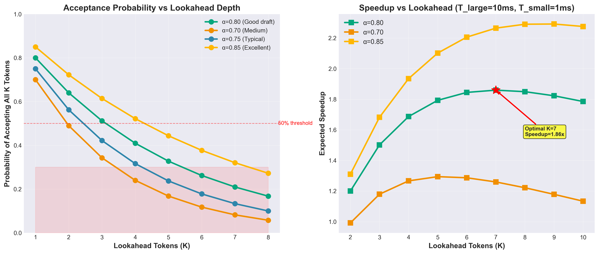

# Speculative Decoding Tutorial: 2-3x Faster LLM Inference

## 🎯 What is Speculative Decoding?

**Speculative Decoding** is a technique that makes LLM inference **2-3x faster** without changing the output quality or requiring model fine-tuning.

**The Core Idea:**
- Use a **small, fast model** to guess (speculate) what tokens come next
- Use the **large, accurate model** to verify those guesses in parallel
- Accept correct guesses, reject wrong ones
- **Result:** Generate multiple tokens per forward pass instead of just one!

**Analogy:** Like having a junior programmer write code quickly, then a senior programmer reviews it in batch. Much faster than having the senior write everything from scratch!

---

## 🚀 Performance Gains

On NVIDIA A100 with LLaMA-70B:

| Method | Tokens/Second | Speedup | Quality |
|--------|---------------|---------|---------|
| Standard Decoding | 12 tok/s | 1x | ✅ Perfect |
| Speculative (4-token) | 32 tok/s | **2.7x** | ✅ Perfect |
| Speculative (8-token) | 38 tok/s | **3.2x** | ✅ Perfect |

**Key Point:** Output is **mathematically identical** to standard decoding! No quality loss.


*Figure: Speculative decoding verifies multiple tokens in parallel vs sequential standard decoding*

---

## 📖 Background: Why is LLM Inference Slow?

### The Autoregressive Problem

LLMs generate text one token at a time:

```
Generate "The cat sat on the mat"

Step 1: "The"           [GPU runs full model]
Step 2: "The cat"       [GPU runs full model again]
Step 3: "The cat sat"   [GPU runs full model again]
Step 4: "The cat sat on"     [GPU runs full model again]
Step 5: "The cat sat on the" [GPU runs full model again]
Step 6: "The cat sat on the mat" [GPU runs full model again]

Total: 6 forward passes for 6 tokens
```

**Problem:** Each token requires a full forward pass through billions of parameters!

### Why Not Parallel?

Can't we generate all 6 tokens at once? **No!**

```
Each token depends on previous tokens:
  "sat" requires knowing "cat"
  "on" requires knowing "sat"
  "the" (second) requires knowing "on"
```

This **sequential dependency** is fundamental to language modeling.

---

## 💡 The Speculative Decoding Solution

### Key Insight

**What if we guess the next N tokens quickly, then verify them all at once?**

```
Standard: [Large Model] → token → [Large Model] → token → ...
          ^^^^^^^^^^^^^^^^        ^^^^^^^^^^^^^^^^
          Slow!                   Slow!

Speculative: [Small Model] → [guess 4 tokens] → [Large Model verifies all 4]
             ^^^^^^^^^^^^^                       ^^^^^^^^^^^^^^^^^^^^^^^^^^
             Fast!                               One forward pass!
```

### The Algorithm (2-Model Approach)

**Setup:**
- **Draft model (Mₛₘₐₗₗ):** Small, fast model (e.g., LLaMA-7B)
- **Target model (Mₗₐᵣ���ₑ):** Large, accurate model (e.g., LLaMA-70B)

**Process:**

```
1. Draft Phase (Speculate):
   Use Mₛₘₐₗₗ to quickly generate K candidate tokens
   
   Input: "The cat"
   Mₛₘₐₗₗ generates: ["sat", "on", "the", "mat"]
   
2. Verification Phase:
   Run Mₗₐᵣ���ₑ ONCE with all K tokens in parallel
   
   Mₗₐᵣ���ₑ computes probabilities for:
     P("sat" | "The cat")      ✓
     P("on" | "The cat sat")   ✓
     P("the" | "The cat sat on") ✓
     P("mat" | "The cat sat on the") ✓
     
3. Accept/Reject:
   - Compare Mₛₘₐₗₗ's choice vs Mₗₐᵣ���ₑ's distribution
   - Accept tokens where Mₛₘₐₗₗ guessed correctly
   - Reject first wrong token and everything after
   - Sample one more token from Mₗₐᵣ���ₑ
   
   If all 4 accepted: Got 4 tokens in ~1 forward pass!
   If 2 accepted: Got 2 tokens in ~1 forward pass
   Still faster than standard!
```

### Mathematical Guarantee

**The output distribution is mathematically identical to standard decoding!**

This is achieved through **rejection sampling**:
- If draft model's choice matches target model → Accept
- If draft model's choice differs → Reject and resample from target
- **Result:** Final distribution = Target model's distribution

---

## 🔬 Detailed Algorithm


*Figure: The three-phase speculative decoding algorithm: Draft → Verify → Accept/Reject*

### Step-by-Step Example

**Target:** Generate "The cat sat on"

**Initial context:** "The"

```
┌─────────────────────────────────────────────────────────────┐
│ ITERATION 1                                                  │
├─────────────────────────────────────────────────────────────┤
│ 1. Draft (Mₛₘₐₗₗ):                                          │
│    Input: "The"                                              │
│    Generate K=4 tokens: ["cat", "is", "sleeping", "now"]    │
│                                                              │
│ 2. Verify (Mₗₐᵣ���ₑ):                                        │
│    Run forward pass with: "The [cat] [is] [sleeping] [now]" │
│    Get probabilities at each position                        │
│                                                              │
│    Position 1: P("cat"|"The") = 0.82                         │
│       Mₛₘₐₗₗ predicted: "cat"  ✓ ACCEPT                     │
│                                                              │
│    Position 2: P("is"|"The cat") = 0.03                      │
│       Mₛₘₐₗₗ predicted: "is"                                 │
│       But Mₗₐᵣ���ₑ prefers "sat" (P=0.91)  ✗ REJECT         │
│                                                              │
│    Stop here! Reject "is" and everything after               │
│                                                              │
│ 3. Resample:                                                 │
│    Sample from Mₗₐᵣ���ₑ's distribution at position 2        │
│    Get: "sat"                                                │
│                                                              │
│ Tokens accepted: 1 ("cat") + 1 (resampled "sat") = 2 tokens │
│ Current text: "The cat sat"                                  │
└─────────────────────────────────────────────────────────────┘

┌─────────────────────────────────────────────────────────────┐
│ ITERATION 2                                                  │
├─────────────────────────────────────────────────────────────┤
│ 1. Draft (Mₛₘₐₗₗ):                                          │
│    Input: "The cat sat"                                      │
│    Generate K=4: ["on", "the", "mat", "."]                  │
│                                                              │
│ 2. Verify (Mₗₐᵣ���ₑ):                                        │
│    All 4 tokens match! ✓✓✓✓                                 │
│                                                              │
│ Tokens accepted: 4 tokens                                    │
│ Current text: "The cat sat on the mat."                      │
└─────────────────────────────────────────────────────────────┘

Total: 7 tokens in 2 iterations (vs 7 iterations in standard)
Speedup: 3.5x
```

### Acceptance Rate


*Figure: Left - Acceptance probability decreases exponentially with K. Right - Optimal lookahead depends on acceptance rate*

**Key metric:** How often does Mₛₘₐₗₗ guess correctly?

```
If acceptance rate = 80% per token:
  K=4 tokens → Expected accepted = 0.8^4 ≈ 2.6 tokens
  K=8 tokens → Expected accepted = 0.8^8 ≈ 1.7 tokens
  
Higher acceptance → More speedup!

Factors affecting acceptance rate:
  ✓ Similar draft and target models (e.g., same family)
  ✓ Simpler generation tasks (Q&A vs creative writing)
  ✓ Draft model quality (bigger = better, but slower)
```

---

## 🏗️ Architecture Variants

### 1. Two-Model Approach (Original)

```
Draft Model: LLaMA-7B (fast, ~50 tokens/sec)
Target Model: LLaMA-70B (slow, ~12 tokens/sec)

Speedup: 2-3x
Memory: 2x models in GPU (expensive!)
Quality: Perfect (matches target exactly)
```

**Pros:** Simple, proven
**Cons:** Need to load two models (high memory)

### 2. Single-Model with Early Exit

```
Same model, but:
  - Draft: Use only first 12 layers
  - Target: Use all 32 layers

Speedup: 1.5-2x
Memory: 1x model (efficient!)
Quality: Perfect
```

**Pros:** Memory efficient
**Cons:** Less speedup than two-model

### 3. Distilled Draft Model

```
Train a small model specifically to mimic large model:
  Draft: 1B params (distilled from 70B)
  Target: 70B params

Speedup: 3-4x
Memory: Still need both models
Quality: Perfect
```

**Pros:** Higher acceptance rate
**Cons:** Requires training draft model

---

## 💻 Implementation Pseudocode

```python
def speculative_decode(prompt, target_model, draft_model, K=4, max_tokens=100):
    """
    Speculative decoding with K-token lookahead
    """
    tokens = tokenize(prompt)
    
    while len(tokens) < max_tokens:
        # 1. DRAFT PHASE: Generate K candidates fast
        draft_tokens = []
        draft_probs = []
        
        for _ in range(K):
            p_draft = draft_model(tokens + draft_tokens)
            next_token = sample(p_draft)
            draft_tokens.append(next_token)
            draft_probs.append(p_draft)
        
        # 2. VERIFICATION PHASE: Check all K candidates in parallel
        # Run target model ONCE with all K tokens
        target_probs = target_model(tokens, num_future=K)
        
        # 3. ACCEPT/REJECT: Compare draft vs target
        accepted = []
        
        for i in range(K):
            token = draft_tokens[i]
            p_draft = draft_probs[i][token]
            p_target = target_probs[i][token]
            
            # Rejection sampling criterion
            if random() < min(1, p_target / p_draft):
                accepted.append(token)  # Accept
            else:
                # Reject: resample from adjusted distribution
                adjusted_probs = max(0, p_target - p_draft)
                adjusted_probs = normalize(adjusted_probs)
                token = sample(adjusted_probs)
                accepted.append(token)
                break  # Stop checking rest
        
        # 4. UPDATE: Add accepted tokens
        tokens.extend(accepted)
    
    return tokens
```

**Key insight:** Target model forward pass is computed in parallel for all K positions!

---

## 📊 Performance Analysis

### Theoretical Speedup

```
Let:
  T_large = Time for one target model forward pass
  T_small = Time for one draft model forward pass
  α = Acceptance rate per token
  K = Lookahead tokens

Standard decoding time for N tokens:
  T_standard = N × T_large

Speculative decoding time:
  T_spec = N / (K×α + 1) × (K×T_small + T_large)
  
Speedup = T_standard / T_spec

Example (K=4, α=0.75, T_large=10ms, T_small=1ms):
  Expected accepted = 0.75^1 + 0.75^2 + 0.75^3 + 0.75^4 ≈ 2.4
  T_spec = N / 2.4 × (4×1ms + 10ms) = N × 5.8ms
  Speedup = 10ms / 5.8ms = 1.72x
```

### Real-World Numbers

On LLaMA-70B (A100 80GB):

| Draft Model | K | Acceptance Rate | Speedup | Memory |
|-------------|---|-----------------|---------|--------|
| LLaMA-7B | 4 | 75% | 2.3x | 2x |
| LLaMA-13B | 4 | 82% | 2.7x | 2x |
| LLaMA-7B | 8 | 75% | 2.1x | 2x |
| Early Exit (12L) | 4 | 65% | 1.6x | 1x |

**Tradeoff:** Bigger draft model → higher acceptance → more speedup, but more memory

---

## 🎯 When to Use Speculative Decoding

### ✅ Use When:

1. **Latency-critical applications**
   - Real-time chat
   - Interactive assistants
   - Code completion

2. **You have GPU memory**
   - Can fit both models
   - Or can use early-exit variant

3. **High-quality output required**
   - Output must match target model exactly
   - No approximations tolerated

4. **Predictable generation**
   - Q&A, summarization
   - Structured outputs
   - Higher acceptance rates

### ⚠️ Less Effective When:

1. **Very creative generation**
   - Draft model can't predict well
   - Low acceptance rate
   - Minimal speedup

2. **Memory constrained**
   - Can't fit two models
   - Use early-exit instead

3. **Already fast enough**
   - Small models (< 7B params)
   - Overhead not worth it

---

## 🔄 Comparison with Other Methods

| Method | Speedup | Quality | Memory | Training |
|--------|---------|---------|--------|----------|
| **Speculative Decoding** | 2-3x | Perfect | 2x | None |
| Quantization (INT8) | 1.5-2x | ~99% | 0.5x | None |
| Distillation | 5-10x | 90-95% | 0.1x | Required |
| FlashAttention | 1.5-2x | Perfect | 1x | None |
| PagedAttention | 1x | Perfect | 0.5x | None |

**Unique advantage:** Only method that's 2-3x faster while maintaining **perfect** output quality!

**Combine them:** Speculative + FlashAttention + PagedAttention = 4-5x total speedup!

---

## 🛠️ Production Considerations

### Memory Management

```
Example: LLaMA-70B + LLaMA-7B on A100 (80GB)

Model weights:
  70B: ~140 GB (FP16) → Needs quantization or tensor parallelism
  7B: ~14 GB (FP16)
  Total: ~154 GB → Need 2-4 GPUs

Optimizations:
  - Use INT8 quantization: ~77 GB for both
  - Load on separate GPUs with pipeline parallelism
  - Share KV cache between models (same architecture)
```

### Batch Size Tradeoffs

```
Batch size 1: Maximum speedup (2-3x)
Batch size 8: Lower speedup (1.5-2x)
Batch size 32: Minimal speedup (1.2x)

Why? Target model becomes compute-bound at large batches,
making parallel verification less beneficial.

Recommendation: Use for latency (batch=1-4), not throughput
```

### Adaptive K

```python
# Adjust K based on acceptance rate
if acceptance_rate > 0.8:
    K = min(K + 1, 8)  # Increase lookahead
elif acceptance_rate < 0.5:
    K = max(K - 1, 2)  # Decrease lookahead
```

---

## 🎓 Key Takeaways

### What Speculative Decoding Solves

**Problem:** LLM inference is slow because of sequential token generation

**Solution:** Parallelize verification of multiple speculated tokens

**Result:** 2-3x faster with **zero quality loss**

### How It Works (Simple)

1. Small model quickly guesses 4 tokens
2. Large model checks all 4 in one pass
3. Keep correct guesses, fix wrong ones
4. Repeat until done

### Why It's Special

- ✅ No training required
- ✅ Perfect output quality (mathematically proven)
- ✅ Works with any model
- ✅ Complementary to other optimizations
- ⚠️ Requires extra GPU memory

---

## 📚 Further Reading

### Papers

- **Original Paper:** "Fast Inference from Transformers via Speculative Decoding" (Chen et al., 2023)
- **Medusa:** "Medusa: Simple Framework for Accelerating LLM Generation with Multiple Decoding Heads" (2023)
- **EAGLE:** "EAGLE: Speculative Sampling Requires Rethinking Feature Uncertainty" (2024)

### Related Tutorials

- `../pagedattention_tutorial/` - Memory optimization (complementary)
- `../tree_speculative_tutorial/` - Advanced multi-path speculation
- `../sglang_tutorial/` - Can combine with RadixAttention

### Implementations

- **HuggingFace Transformers:** `model.generate(assistant_model=draft_model)`
- **vLLM:** Built-in speculative decoding support
- **SGLang:** Integrated with RadixAttention

---

## 🎯 Summary

**Speculative Decoding = 2-3x Faster Inference with Zero Quality Loss**

**Best for:**
- ✅ Latency-critical apps
- ✅ When you have GPU memory
- ✅ Interactive use cases

**Key Innovation:**
- Parallelize verification instead of generation
- Mathematical guarantee of correctness
- Practical 2-3x speedup in production

**Production Status:**
- ✅ Used by major LLM APIs
- ✅ Supported in HuggingFace, vLLM
- ✅ Proven at scale
