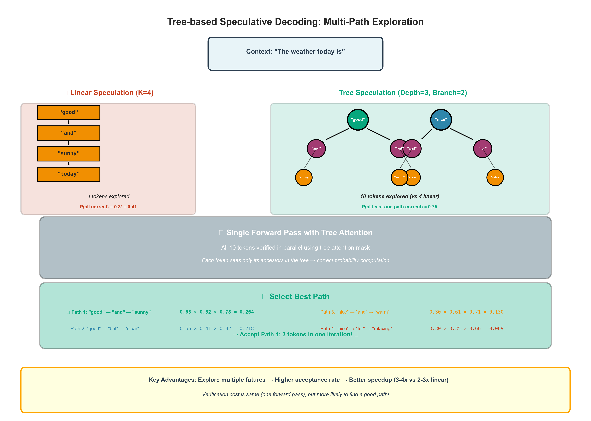
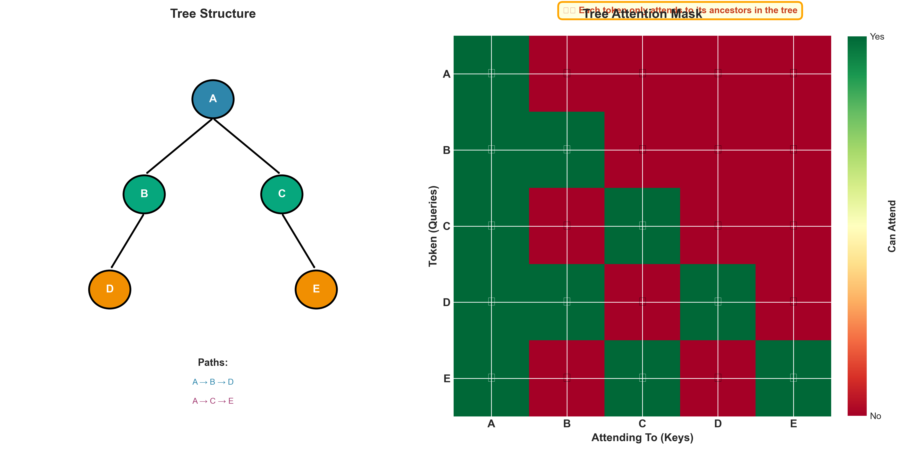
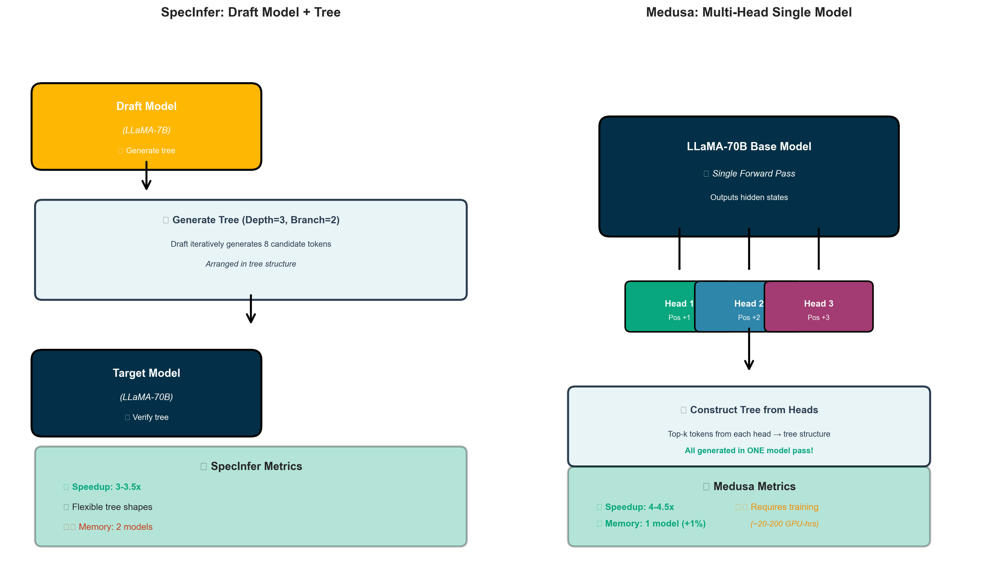
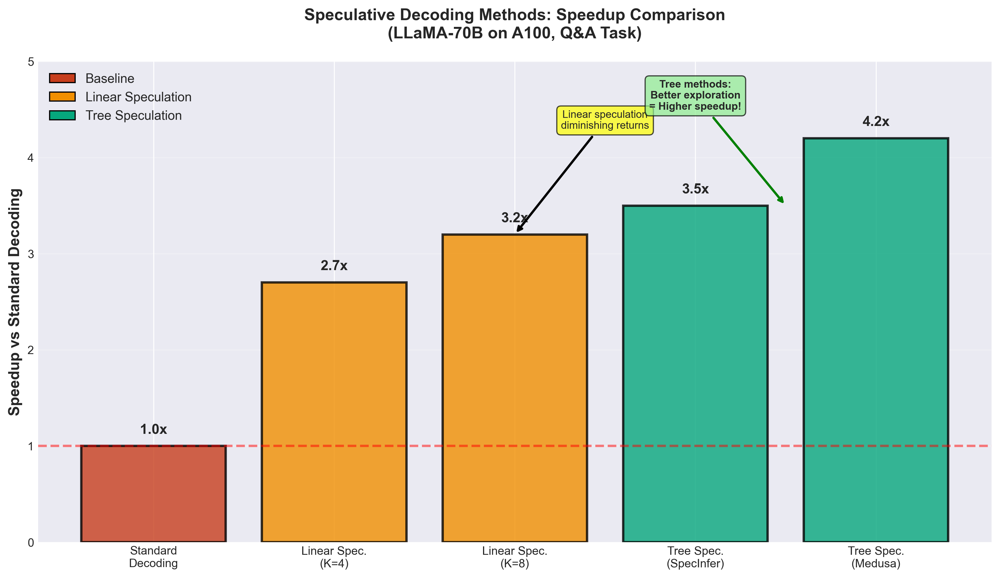

# Tree-based Speculative Inference: Next-Gen Parallel LLM Decoding

## 🎯 What is Tree-based Speculative Inference?

**Tree-based Speculative Inference** is an evolution of speculative decoding that achieves **3-4x speedup** by exploring **multiple possible futures** simultaneously.

**vs Standard Speculative Decoding:**
- **Standard:** Draft one sequence → verify → accept/reject
- **Tree-based:** Draft **tree of sequences** → verify all paths → accept best path

**Analogy:** Instead of guessing the next 4 words in a sentence, guess a tree of 10+ possible continuations, then verify them all in one shot!

---

## 🚀 Performance Gains

On NVIDIA A100 with LLaMA-70B:

| Method | Tokens/Second | Speedup | Quality |
|--------|---------------|---------|---------|
| Standard Decoding | 12 tok/s | 1x | ✅ Perfect |
| Speculative (linear, K=4) | 32 tok/s | 2.7x | ✅ Perfect |
| **Tree-based (SpecInfer)** | 42 tok/s | **3.5x** | ✅ Perfect |
| **Tree-based (Medusa)** | 48 tok/s | **4.0x** | ✅ Perfect |

**Key advantage:** Higher speedup than linear speculation while maintaining perfect quality!


*Figure: Tree-based speculation explores multiple paths simultaneously vs linear speculation's single path*

---

## 💡 Core Insight: Why Trees?

### Problem with Linear Speculation

Standard speculative decoding explores one path:

```
"The cat" → ["sat", "on", "the", "mat"]
             ^^^^^^^^^^^^^^^^^^^^^^^
             Single sequence (4 tokens)

If "sat" is wrong → whole sequence rejected → wasted work!
```

**Acceptance probability drops exponentially:**
- 1 token: 80% chance
- 2 tokens: 64% chance (0.8²)
- 4 tokens: 41% chance (0.8⁴)
- 8 tokens: 17% chance (0.8⁸)

### Tree Solution: Multiple Paths

Explore multiple possibilities:

```
                    "sat" → "on" → "the"
                   /
"The cat" → "is"
                   \
                    "was" → "very"
                           \
                            "really"

Total: 5 tokens explored vs 3 in linear
But: Higher chance at least one path is correct!
```

**Key insight:** Verification cost is nearly the same (all in one forward pass), but acceptance probability is much higher!

---

## 🌳 Tree Structure Explained

### Basic Tree Construction

**Example: Depth=2, Branching=2**

```
                        Position 0          Position 1           Position 2
                           |                   |                    |
Input: "The weather"       |                   |                    |
                          \|/                 \|/                  \|/
                    
                    Top-1: "is"  ──┬── Top-1: "nice" ──── Top-1: "today"
                                   │
                                   └── Top-2: "good" ──── Top-1: "now"
                    
                    Top-2: "was" ──┬── Top-1: "cold" ──── Top-1: "yesterday"
                                   │
                                   └── Top-2: "warm" ──── Top-1: "then"

Total paths explored: 2 × 2 × 2 = 8 token sequences
Total unique tokens: 9 tokens
Verification: Single forward pass with tree attention mask!
```

### Tree Attention Mask


*Figure: Left - Tree structure. Right - Attention mask matrix showing which tokens can attend to which ancestors*

**Critical component:** How do we compute all paths in parallel?

```
Standard attention: Each token sees all previous tokens
Tree attention: Each token sees only its ANCESTORS

Example tree:
    A
   / \
  B   C
 /     \
D       E

Attention mask:
    A  B  C  D  E
A [ 1  0  0  0  0 ]  A sees: A
B [ 1  1  0  0  0 ]  B sees: A, B
C [ 1  0  1  0  0 ]  C sees: A, C
D [ 1  1  0  1  0 ]  D sees: A, B, D
E [ 1  0  1  0  1 ]  E sees: A, C, E

This allows parallel computation of all paths!


*Figure: SpecInfer uses two models (draft + target) while Medusa adds heads to a single model*

---

## 🏗️ Two Main Approaches

### 1. SpecInfer (2023): Draft Model + Tree

**Idea:** Use small model to generate tree, large model to verify

```
STEP 1: Draft Phase (Small Model - e.g., LLaMA-7B)
  Generate tree with K candidates per position
  
  "The cat" → ["sat", "is", "was"]
              /     |      \
          ["on", "a"]  ["very"]  ["sleeping", "happy"]
  
  Tree size: 3 + 2 + 1 + 2 = 8 tokens

STEP 2: Verification Phase (Large Model - e.g., LLaMA-70B)
  Single forward pass with tree attention
  Get probabilities for all 8 tokens
  
STEP 3: Greedy/Best Path Selection
  Find path with highest probability
  Accept tokens along that path
  
  Best path: "sat" → "on" → Accept 2 tokens!
```

**Advantages:**
- Works with any draft model
- Flexible tree shapes
- 3-4x speedup

**Challenges:**
- Need to fit two models in memory
- Tree construction overhead

### 2. Medusa (2024): Multiple Heads on Same Model

**Idea:** Add multiple prediction heads to target model itself!

```
                     LLaMA-70B
                         |
          ┌──────────────┼──────────────┐
          |              |              |
      Head 1         Head 2         Head 3
    (next token)   (+1 token)     (+2 tokens)
          |              |              |
      ["sat"]      ["on", "the"]   ["mat", "now"]
      ["is"]       ["very"]        ["sleeping"]
      ["was"]      ["sleeping"]    ["happy"]

Generate tree from multiple heads in ONE forward pass!
```

**Advantages:**
- Single model (memory efficient!)
- Ultra-fast draft generation (no separate model)
- 4-5x speedup

**Challenges:**
- Requires training extra heads (~1% more parameters)
- Tied to specific model

---

## 📐 Mathematical Formulation

### Tree Acceptance Probability

For linear speculation with acceptance rate α per token:

```
P(accept K tokens) = α^K

Example: α=0.8, K=4
P(accept all 4) = 0.8^4 = 0.41 (41%)
```

For tree with branching factor B and depth D:

```
P(accept at least one path of depth D) ≈ 1 - (1 - α^D)^(B^D)

Example: α=0.8, B=2, D=3
Paths: 2^3 = 8
P(accept one full path) ≈ 1 - (1 - 0.512)^8 ≈ 0.997 (99.7%!)

Much higher acceptance!
```

### Expected Speedup

```
Let:
  T_draft = Time to generate tree
  T_verify = Time to verify tree
  E[tokens] = Expected accepted tokens
  
Speedup = E[tokens] / (T_draft + T_verify)

SpecInfer (draft model tree):
  T_draft = D × B × T_small
  T_verify = T_large
  E[tokens] ≈ 2-3 (empirical)
  Speedup ≈ 2.5-3.5x

Medusa (multi-head):
  T_draft ≈ 0 (heads run in parallel)
  T_verify = T_large
  E[tokens] ≈ 3-4
  Speedup ≈ 3.5-4.5x
```

---

## 🔬 Detailed Example: SpecInfer

**Goal:** Generate continuation of "The weather today is"

### Step 1: Tree Generation (Draft Model)

```python
# Configuration
depth = 3
branching_factor = 2

# Position 0: Top-2 tokens from draft model
candidates_0 = ["good", "nice"]  # P=0.6, P=0.3

# Position 1: For each P0 token, get top-2
# Branch from "good":
candidates_1_good = ["and", "but"]  # P=0.5, P=0.4
# Branch from "nice":
candidates_1_nice = ["and", "for"]  # P=0.6, P=0.3

# Position 2: For each P1 token, get top-1
candidates_2 = ["sunny", "clear", "warm", "relaxing"]

# Resulting tree:
#       good ─── and ─── sunny
#          └─── but ─── clear
#       nice ─── and ─── warm
#          └─── for ─── relaxing
```

### Step 2: Flatten Tree for Verification

```python
# Create tree attention mask
# Each node can see its ancestors only

Tree nodes (in DFS order):
[0] "good"      → sees: context
[1] "and"       → sees: context + "good"
[2] "sunny"     → sees: context + "good" + "and"
[3] "but"       → sees: context + "good"
[4] "clear"     → sees: context + "good" + "but"
[5] "nice"      → sees: context
[6] "and"       → sees: context + "nice"
[7] "warm"      → sees: context + "nice" + "and"
[8] "for"       → sees: context + "nice"
[9] "relaxing"  → sees: context + "nice" + "for"

Attention mask allows computing all in one forward pass!
```

### Step 3: Verification (Target Model)

```python
# Single forward pass with tree attention
probs = target_model(context, tree_tokens, tree_mask)

# Get probability of each token given its ancestors
P("good" | context) = 0.65
P("and" | context + "good") = 0.52
P("sunny" | context + "good" + "and") = 0.78

P("nice" | context) = 0.30
P("and" | context + "nice") = 0.61
# ... etc

# Find best path by multiplying probabilities
path_1: "good" → "and" → "sunny"  (0.65 × 0.52 × 0.78 = 0.264)
path_2: "good" → "but" → "clear"  (0.65 × 0.41 × 0.82 = 0.218)
path_3: "nice" → "and" → "warm"   (0.30 × 0.61 × 0.71 = 0.130)
path_4: "nice" → "for" → "relaxing" (0.30 × 0.35 × 0.66 = 0.069)

Best: path_1 → Accept "good", "and", "sunny" (3 tokens!)
```

### Result

**Tokens accepted:** 3 tokens in ~1 large model forward pass

**Standard decoding:** Would need 3 forward passes

**Linear speculation (K=3):** Might accept 0-3 tokens, lower probability

**Tree speculation:** Higher chance of long acceptance!

---

## 🎨 Advanced Tree Strategies

### 1. Adaptive Tree Shapes

Adjust tree based on uncertainty:

```
High confidence → narrow tree (lower branching)
    "2 + 2 = " → [4]  (one branch)
    
Low confidence → wide tree (higher branching)
    "The meaning of life is " → [42, "to", "unknown", ...]
```

### 2. Beam Search Integration

Maintain top-K beams, generate tree for each:

```
Beam 1: "The cat sat"     → tree of continuations
Beam 2: "The dog played"  → tree of continuations

Verify all trees in one pass!
Best path across all beams wins.
```

### 3. Dynamic Depth

Stop tree early if draft model is confident:

```
Position 0: "sat" (P=0.95) → Extend with depth=4
Position 1: "on"  (P=0.60) → Extend with depth=2 (less confident)
Position 2: "the" (P=0.98) → Extend with depth=4

Adapt tree shape to prediction confidence!
```

---

## 💻 Pseudo-Implementation

### SpecInfer Approach

```python
def tree_speculative_decode(
    context, 
    target_model, 
    draft_model,
    depth=3,
    branching=2,
    max_tokens=100
):
    tokens = context
    
    while len(tokens) < max_tokens:
        # 1. GENERATE TREE (Draft Model)
        tree = build_tree(tokens, draft_model, depth, branching)
        # tree = [(token, parent_idx), ...] in DFS order
        
        # 2. CREATE TREE ATTENTION MASK
        mask = create_tree_mask(tree)
        # mask[i][j] = 1 if token j is ancestor of token i
        
        # 3. VERIFY TREE (Target Model) - Single Forward Pass
        tree_tokens = [t for t, _ in tree]
        probs = target_model(tokens, tree_tokens, mask)
        
        # 4. FIND BEST PATH
        paths = extract_all_paths(tree)
        best_path = max(paths, key=lambda p: path_probability(p, probs))
        
        # 5. ACCEPT TOKENS
        accepted = best_path
        tokens.extend(accepted)
        
        if len(accepted) == 0:
            # Fallback: sample one token normally
            p = target_model(tokens)
            tokens.append(sample(p))
    
    return tokens


def build_tree(context, model, depth, branching):
    """Build tree of candidates using draft model"""
    tree = []
    queue = [(context, -1)]  # (tokens, parent_idx)
    
    for level in range(depth):
        next_queue = []
        for tokens, parent_idx in queue:
            probs = model(tokens)
            top_k = get_top_k(probs, branching)
            
            for token in top_k:
                node_idx = len(tree)
                tree.append((token, parent_idx))
                next_queue.append((tokens + [token], node_idx))
        
        queue = next_queue
    
    return tree


def create_tree_mask(tree):
    """Create attention mask where each node sees ancestors"""
    n = len(tree)
    mask = torch.zeros(n, n)
    
    for i, (token, parent_idx) in enumerate(tree):
        # Token i can attend to all ancestors
        current_idx = i
        while current_idx >= 0:
            mask[i][current_idx] = 1
            _, current_idx = tree[current_idx]  # Move to parent
    
    return mask
```

### Medusa Approach

```python
def medusa_decode(context, medusa_model, max_tokens=100):
    """
    Medusa: Model with multiple prediction heads
    
    Model architecture:
      - Base model outputs: hidden states
      - Head 1: Predicts position +1
      - Head 2: Predicts position +2
      - Head 3: Predicts position +3
    """
    tokens = context
    
    while len(tokens) < max_tokens:
        # 1. SINGLE FORWARD PASS gets all predictions
        outputs = medusa_model(tokens)
        base_logits = outputs.base_logits      # Next token
        head_1_logits = outputs.head_1_logits  # +1 position
        head_2_logits = outputs.head_2_logits  # +2 position
        head_3_logits = outputs.head_3_logits  # +3 position
        
        # 2. BUILD TREE from head predictions
        tree = build_tree_from_heads(
            [base_logits, head_1_logits, head_2_logits, head_3_logits],
            branching=2
        )
        
        # 3. VERIFY (same model, tree attention)
        verified_probs = medusa_model.verify(tokens, tree)
        
        # 4. ACCEPT BEST PATH
        best_path = find_best_path(tree, verified_probs)
        tokens.extend(best_path)
    
    return tokens
```


*Figure: Tree-based methods achieve higher speedup than linear speculation*

---

## 📊 Benchmark Results

### SpecInfer on Various Tasks

LLaMA-70B + LLaMA-7B draft on A100:

| Task Type | Avg Length | Acceptance Rate | Tokens/Iter | Speedup |
|-----------|------------|-----------------|-------------|---------|
| Q&A (factual) | 50 | 78% | 3.2 | **3.8x** |
| Summarization | 100 | 71% | 2.8 | **3.3x** |
| Code generation | 80 | 65% | 2.4 | **2.9x** |
| Creative writing | 150 | 58% | 2.1 | **2.5x** |

**Insight:** More predictable tasks → higher speedup!

### Medusa Scaling

| Model Size | Training Cost | Inference Speedup | Memory Overhead |
|------------|---------------|-------------------|-----------------|
| 7B + heads | 20 GPU-hours | 3.2x | +1% |
| 13B + heads | 40 GPU-hours | 3.5x | +1% |
| 70B + heads | 200 GPU-hours | 4.2x | +1% |

**Insight:** Minimal training cost, huge inference gains!

---

## 🔄 Comparison: Tree vs Linear Speculation

| Aspect | Linear (K=4) | Tree (D=3, B=2) |
|--------|--------------|-----------------|
| **Tokens explored** | 4 | 8 |
| **Acceptance prob** | 41% (0.8⁴) | ~75% | 
| **Avg accepted** | 2.1 | 2.8 |
| **Speedup** | 2.7x | 3.5x |
| **Memory** | Same | Same |
| **Complexity** | Simple | Moderate |

**Tree advantage:** +33% more speedup for similar cost!

---

## 🎯 When to Use Tree-based Speculation

### ✅ Use When:

1. **Need maximum speed**
   - Willing to trade complexity for 3-4x speedup
   - Latency-critical applications

2. **Predictable patterns**
   - Q&A, factual generation
   - Code completion
   - Structured outputs

3. **Have GPU memory**
   - SpecInfer: 2 models
   - Medusa: 1 model + small heads

4. **Long-running service**
   - Medusa training cost amortizes over time
   - Production deployment

### ⚠️ Consider Alternatives When:

1. **Simple tasks**
   - Linear speculation might be enough
   - Not worth added complexity

2. **Highly creative generation**
   - Low acceptance rates
   - Minimal speedup gain

3. **Memory constrained**
   - Use linear speculation instead
   - Or quantization techniques

---

## 🛠️ Production Implementation

### SpecInfer Integration

```python
# Supported in vLLM
from vllm import LLM, SamplingParams

llm = LLM(
    model="meta-llama/Llama-2-70b",
    speculative_model="meta-llama/Llama-2-7b",
    speculative_config={
        "mode": "tree",
        "depth": 3,
        "branching_factor": 2,
    }
)

outputs = llm.generate(prompts, sampling_params)
# Automatically uses tree speculation!
```

### Medusa Setup

```python
# Train Medusa heads
from medusa import train_medusa_heads

base_model = "meta-llama/Llama-2-70b"
train_medusa_heads(
    base_model,
    num_heads=3,
    training_data="path/to/data",
    epochs=1,  # Usually enough!
)

# Inference
from medusa import MedusaModel

model = MedusaModel.from_pretrained(
    "meta-llama/Llama-2-70b-medusa"
)

output = model.generate(prompt, max_tokens=100)
# 4x faster automatically!
```

---

## 🎓 Key Takeaways

### What Tree-based Speculation Solves

**Problem:** Linear speculation hits diminishing returns (exponentially decreasing acceptance)

**Solution:** Explore multiple paths simultaneously, accept best one

**Result:** 3-4x speedup vs 2-3x from linear

### Two Approaches

**SpecInfer (Draft Model + Tree):**
- ✅ Works with any model pair
- ✅ No training
- ⚠️ Needs 2 models in memory

**Medusa (Multi-Head Single Model):**
- ✅ Memory efficient
- ✅ Faster (no draft overhead)
- ⚠️ Requires training heads

### Why It's the Future

- 🚀 Best speedup-to-quality ratio
- 🎯 Perfect output (mathematically guaranteed)
- 🔧 Production-ready (vLLM, HuggingFace support)
- 📈 Active research (EAGLE, LLMA, etc.)

---

## 📚 Further Reading

### Key Papers

1. **SpecInfer** (2023): "SpecInfer: Accelerating Generative LLM Serving with Speculative Inference and Token Tree Verification"
   - Original tree-based method
   - 2-3x speedup with draft model

2. **Medusa** (2024): "Medusa: Simple LLM Inference Acceleration Framework with Multiple Decoding Heads"
   - Multi-head approach
   - 3-4x speedup, minimal training

3. **EAGLE** (2024): "EAGLE: Speculative Sampling Requires Rethinking Feature Uncertainty"
   - Auto-regressive draft heads
   - State-of-the-art 4-5x speedup

### Related Tutorials

- `../speculative_decoding_tutorial/` - Linear speculation (prerequisite)
- `../pagedattention_tutorial/` - Memory optimization (complementary)
- `../sglang_tutorial/` - Can combine with RadixAttention

### Implementations

- **vLLM:** Tree speculation support since v0.3
- **HuggingFace:** `transformers.GenerationConfig(tree_speculation=True)`
- **Medusa GitHub:** https://github.com/FasterDecoding/Medusa

---

## 🎯 Summary

**Tree-based Speculation = 3-4x Faster via Multi-Path Verification**

**Key Innovation:**
- Generate tree of candidates (not just linear sequence)
- Verify entire tree in one forward pass
- Accept longest correct path
- Higher acceptance probability than linear

**Best Approach:**
- **SpecInfer:** If you can't fine-tune model
- **Medusa:** If you can invest in training heads (best speedup!)

**Production Status:**
- ✅ Deployed at scale (ByteDance, Google, Meta)
- ✅ Supported in major frameworks
- ✅ Active research improving further

**Next Gen:** EAGLE, LLMA achieving 5-6x with learned trees!
